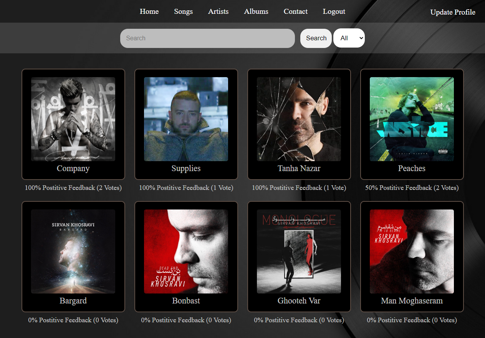
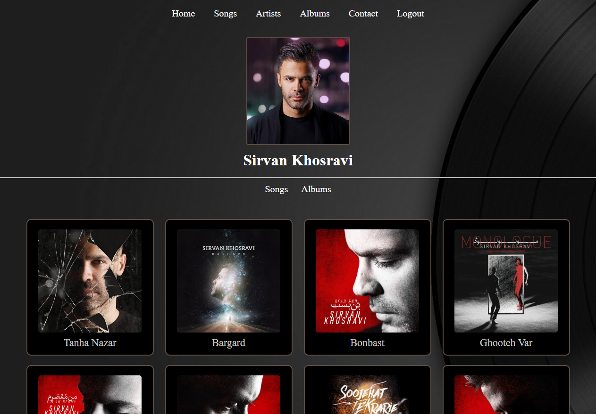
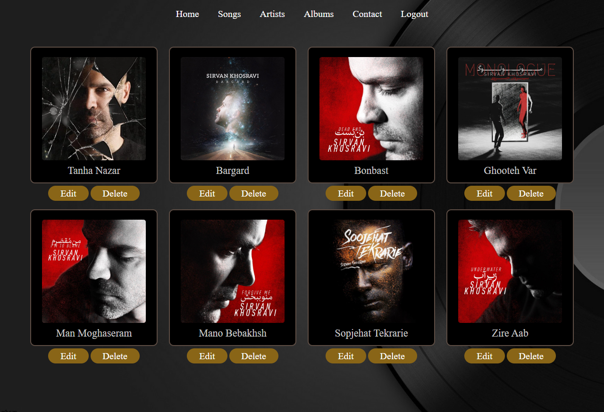
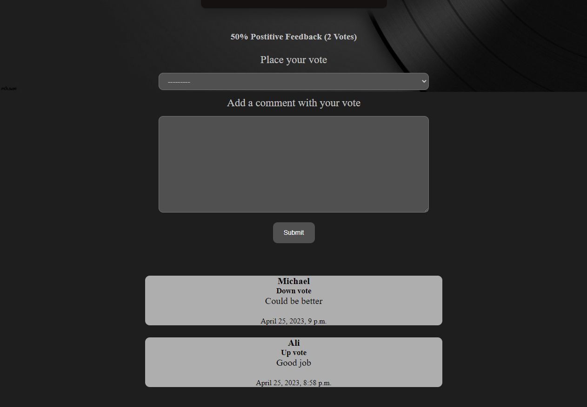
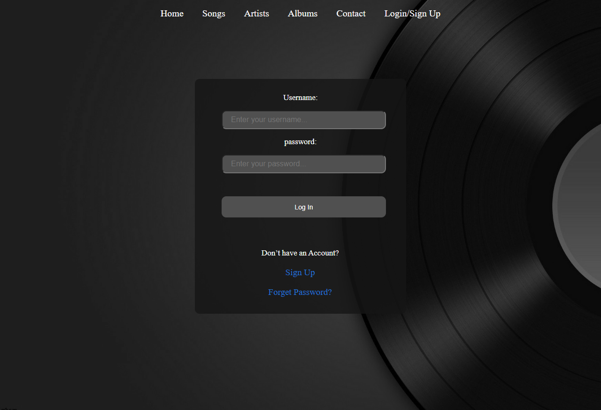
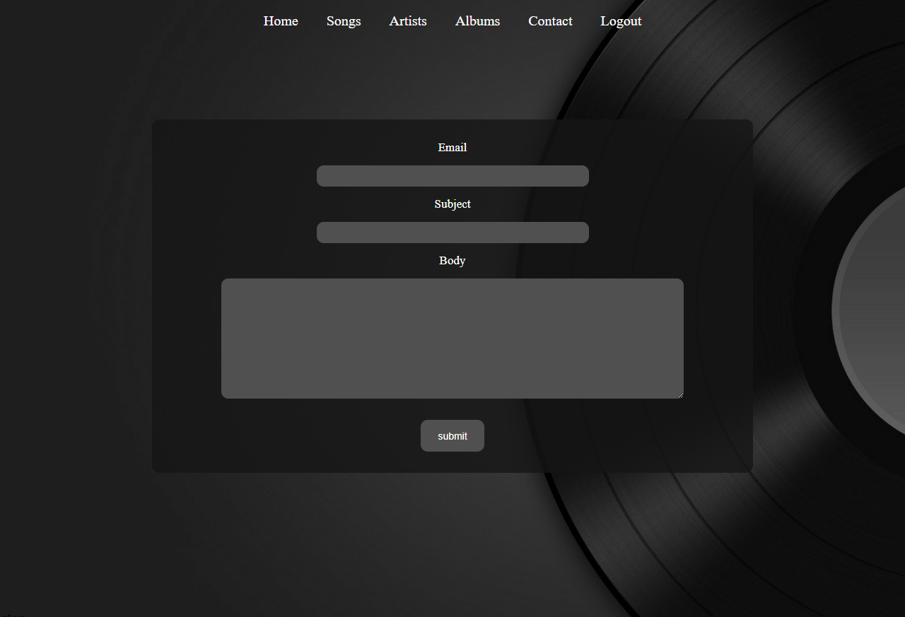
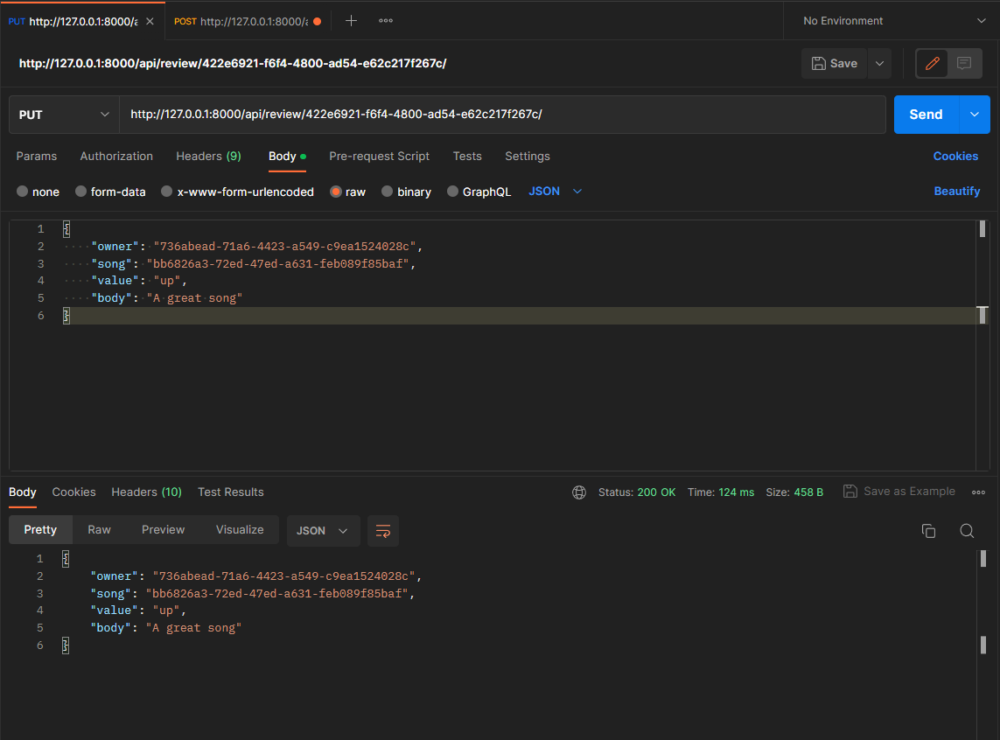

# :computer: Music Website

A website for sharing music

# Tech Stack
* Django
* Postgres
* Django REST Framework

# Features
* Register as user profile or artist profile
* Update profile
* Reset password via email
* CRUD operations on songs and albums for artists
* Search on songs, albums, artists
* Comment and vote on songs
* Contact via contact form

# Home Page

# Artist Page

# Edit Songs

# Comments

# Login Page

# Contact Page

# Updating a Review by sending a PUT request
